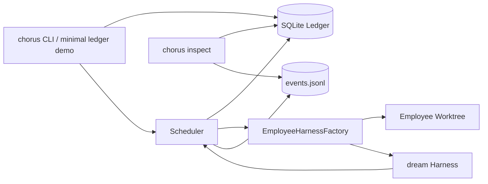

# The Engineer — build plan for the remaining harness surfaces

A build plan (not a status report) for finishing the Engineer's harness: **hooks, skill files,
plugins, MCP, memory**, and the **spec-08 observability wiring**. Each heading is a self-contained
slice with
a goal, the design, the files to touch, TDD steps, acceptance, and risk — written so a fresh agent can
pick up any one cold.

> **Heading count:** the request named hooks · skill files · plugins · MCP · observability, plus
> **memory**. Observability is split into its two separately-shippable build units — **the event log
> (spine)** and **the inspector** — for **7** sections in all.

**Where these plug in:** the manifest is
[`chorus_employee/engineer/_harness.py`](../../../src/chorus_employee/engineer/_harness.py) (the
component declaration); the materializer is
[`chorus_harness/_factory.py`](../../../src/chorus_harness/_factory.py) (turns the manifest into a
`dream.build_harness(...)` call in the worktree). `skills`/`mcp`/`plugins` are role-manifest knobs,
`hooks` are a Dream plugin-installed surface rather than a direct `build_harness(hooks=...)` knob, and
the Spec-08 event spine is now a concrete JSONL-backed bus that tick and chat can both feed.

**Cross-cutting Dream execution-layer facts (verified against `dream/src/dream/_factory.py`).**
`dream.build_harness(...)` accepts `registry`, `skill_registry`, `skills`, `memory`,
`working_memory`, `mcp`, `plugins`, `skill_event_sink`, `env`, and `wake_model`. MCP and plugins are
loaded lazily at the first session start; missing config is treated as an empty surface. Skills can be
workspace-discovered or supplied through an explicit `SkillRegistry`. Workspace memory is currently
project-dir based; there is no direct Chorus memory-scope partition knob yet. There is still no direct
`hooks=` param; hooks should be treated as a Dream plugin capability unless Dream later exposes a
first-class hook config loader.

**Global definition of done (every slice):** ruff + mypy `--strict` + full pytest green; a keyed e2e
through the CLI proving the surface works on a real beat; clean enum-driven Python (frozen dataclasses,
StrEnums, no `getattr`/`setattr`); chorus core stays dream-free (only `chorus_harness` imports dream).

## Completion Review

This spec is complete as a build plan when it answers four questions for each remaining surface:

| Surface | Current repo truth | Build decision | Status |
|---|---|---|---|
| Hooks | Dream has no `hooks=` factory knob; plugins can install hooks/providers/tools. | Do not add Chorus-only hook syntax until Dream exposes or documents a hook loader. Prefer plugin-backed hooks. | Design-gated |
| Skill files | Dream supports `skill_registry` and workspace skill discovery. Chorus only passes `skills=bool(config.skills)` today. | Add a role skill registry in `chorus_harness`, then package Engineer playbooks. | Ready |
| Plugins | Dream already loads repo-local plugins when `plugins=True`. | Treat plugins as seeded-repo features; flip Engineer only when demo seed carries one. | Ready |
| MCP | Dream already admits working-dir MCP allowlists when `mcp=True`. | Add typed `McpServerSpec` renderer only for explicit Chorus-managed allowlists; otherwise rely on seeded repo config. | Ready with secret guard |
| Event log | Chorus had a stub bus; now `EventBus(log_path=...)` appends/replays JSONL and `FanoutBus` isolates sink failure. | Use this as the durable Spec-08 spine; inspector reads it next. | Implemented baseline |
| Inspector | `LedgerInspector` remains a pure read-model stub. | Build blocked inbox first from ledger, then live surface from `events.jsonl`. | Ready |
| Memory | Dream memory is project-dir based; Chorus does not write per-beat episodic deltas. | Add append-only writer + scheduler injection; scope partitioning waits on Dream memory-dir/scope seam. | Ready, scope-gated |

## High-Level Design



Chorus owns the organization plane: employees, task assignment, run rows, recovery cards, budgets,
worktree isolation, role manifests, and durable observability. Dream owns the execution plane: tool
dispatch, planner/generator/evaluator flow, skills, memory catalogue/tools, MCP admission, plugins,
and the structured `run.*` event stream. The seam stays narrow: Chorus materializes a role-faithful
Dream harness in the employee worktree, calls `run_task`, records a `BeatOutcome`, and persists both
ledger state and typed events.

The Engineer harness is complete when every role-surface is either (a) directly threaded into
`dream.build_harness`, (b) rendered into the worktree config Dream already reads, or (c) explicitly
gated behind a Dream execution-layer seam that does not exist yet. No Chorus core module may import
Dream; all execution-layer imports remain in `chorus_harness` or adapter packages.

## Low-Level Design

| Layer | Contract | Concrete files | Notes |
|---|---|---|---|
| Role declaration | `RoleManifest` frozen dataclass | `src/chorus/roles/_manifest.py`, `src/chorus_employee/engineer/_harness.py` | Add only typed fields; keep env non-secret. |
| Beat projection | `RoleBeatConfig` | `src/chorus/roles/_beat_config.py` | Carries Dream factory knobs as plain strings/bools. |
| Materialization | `EmployeeHarnessFactory.materialize(employee)` | `src/chorus_harness/_factory.py` | Writes overlays/sandbox, builds Dream harness, wraps `DreamBeatRunner`. |
| Execution seam | `BeatRunner.run_task(...) -> BeatOutcome` | `src/chorus/adapters/dream_beat.py` | Uses Dream as execution layer; timeout + local command-DoD fallback prevents stranded runs. |
| Durable event spine | `EventBus.emit/replay`, `FanoutBus.emit` | `src/chorus/observability/_bus.py` | JSONL lines are typed `Event` envelopes; fanout failures never fail beats. |
| CLI wiring | `build_beat_service`, `build_role_chat_service` | `src/chorus_cli/_beats.py`, `src/chorus_cli/_role_chat.py` | Tick logs directly; chat fans out render + log. |
| Inspector read model | `LedgerInspector` | `src/chorus/observability/_inspector.py` | Build blocked inbox first, live surface second. |
| Memory writer | `MemoryWriter` protocol + append-only writer | `src/chorus/memory/_writer.py` (planned) | Scheduler injection; Dream scope partitioning remains gated. |

---

## 1. Hooks

**Goal.** Give a role lifecycle hooks — `PreToolUse` / `PostToolUse` / `Stop` — so the Engineer can,
e.g., run `ruff format` after every `write_file`, or a guard before `bash`.

**Design.** Add a `hooks` component to `RoleManifest`, render it into the worktree's `.harness/`, and
have dream load it. `.harness/` is already chorus's per-beat config dir (it writes `sandbox.toml`
there), so hooks slot in beside it.

**Slices.**
1. **Spike (blocking):** does dream load hooks from `.harness/`? If not, add hook support to dream
   first (its own change) — define the file format (`.harness/hooks.toml`: matcher → command, by
   event) and the load point in `run_task`. *Do not build chorus-side until this is answered.*
2. `HookSpec` frozen dataclass (`event: HookEvent` StrEnum, `matcher: str`, `command: str`) +
   `hooks: tuple[HookSpec, ...] = ()` on `RoleManifest`; project it through `RoleBeatConfig` +
   `resolve_manifest` (carry through the overlay, monotone).
3. `write_hooks_config(worktree, hooks)` in `chorus_harness` (mirrors `write_sandbox_config`); the
   factory calls it in `materialize`. Add `hooks/` to the worktree's `_OPERATIONAL_EXCLUDES` so it
   never merges into `main`.
4. Engineer manifest: one real hook — `PostToolUse` on `write_file` → `ruff format {file}` (keeps the
   `ruff check` DoD from failing on formatting).

**Tests/acceptance.** Unit: factory writes `.harness/hooks.toml` with the engineer's hook. Keyed e2e:
the engineer edits a badly-formatted file → the hook reformats it → `pytest && ruff` passes first try.

**Risk.** High — gated on the dream spike. If dream won't take hooks, this is a dream feature, not a
chorus one. **Effort:** spike 1d + chorus 0.5d.

---

## 2. Skill files

**Goal.** Author Engineer skill playbooks (e.g. `tdd`, `py-refactor`) and load them, so the model can
pull a playbook mid-task.

**Design.** The factory already passes `skills=bool(config.skills)`, but **not** a `skill_registry`,
so today even `skills=True` only enables discovery, not chorus-authored playbooks. Two parts: (a)
thread a `skill_registry`; (b) write the playbooks.

**Slices.**
1. Thread `skill_registry`: build a `dream.SkillRegistry` from the role's named skills and pass it to
   `build_harness(skill_registry=…, skills=True)`. New helper `_skill_registry(names)` in the factory
   (mirrors `_role_registry`).
2. Author playbooks as markdown under `chorus_employee/engineer/skills/` (e.g. `tdd.md`,
   `py-refactor.md`); package them (add to wheel/sdist data).
3. Engineer manifest: `skills=("tdd", "py-refactor")`; the factory resolves names → registry.

**Tests/acceptance.** Unit: factory passes a `skill_registry` containing the engineer's skills +
`skills=True`. Keyed e2e: a task whose intent invites a playbook → the run's `RUN_TOOL_USE` stream
shows the skill being loaded.

**Risk.** Medium — depends on dream's `SkillRegistry` construction API (pin in the §1 spike).
**Effort:** 1d.

---

## 3. Plugins

**Goal.** Let the Engineer load repo-local plugins (one of dream's two async action surfaces).

**Design.** `plugins=bool(config.plugins)` is already threaded. The missing pieces are the **decision
of where plugins come from** (the seeded repo's own `.dream/plugins`, vs chorus-injected) and turning
the flag on.

**Slices.**
1. Decide source: for a **seeded** company (`CHORUS_COMPANY_SEED` → real repo), plugins ride in the
   repo and need no chorus work — just `plugins=True`. For **greenfield**, there are none; document
   that plugins are a seeded-repo feature.
2. Engineer manifest: `plugins=True` (factory already forwards it).
3. Keyed e2e against a seed repo carrying a trivial plugin → assert it loads.

**Tests/acceptance.** Unit: `captured["plugins"] is True` for the engineer. E2e: seeded plugin appears
in the run.

**Risk.** Low — mostly a flag + a decision. **Effort:** 0.5d.

---

## 4. MCP

**Goal.** Enable the MCP action surface so the Engineer can call MCP-server tools.

**Design.** `mcp=bool(config.mcp)` is threaded, but dream reads the **working dir's MCP allowlist** —
which a fresh worktree doesn't have. Add a renderer that writes the allowlist into the worktree, and
flip the flag. MCP servers that touch the network interact with the **sandbox tier** (§trust): an
MCP-using role may need `REPO_WRITE_NET` rather than the engineer's current `UNRESTRICTED`-in-worktree.

**Slices.**
1. `mcp: tuple[McpServerSpec, ...]` on the manifest (name + transport + allowlisted tools); project
   through `RoleBeatConfig`. (Keep the bool for "discover working-dir MCP" vs explicit servers.)
2. `write_mcp_config(worktree, servers)` in `chorus_harness`; factory calls it; add to excludes.
3. Decide secret handling — MCP server creds must come from `env`/a secret-ref, **never** inline
   (reuse the "never carries secrets" rule on `env`).
4. Engineer manifest: leave `mcp=False` by default; ship one example server config + an opt-in path.

**Tests/acceptance.** Unit: factory writes the MCP allowlist + passes `mcp=True` when servers are
present. E2e: a stub MCP server's tool is callable in a beat.

**Risk.** Medium-high — secret handling + net-tier interplay. **Effort:** 1.5d.

---

## 5. Observability — the event log (spine)

**Goal.** Persist the run's event stream to a durable `events.jsonl` per workforce (spec 08 §1) so the
inspector/audit have a spine, instead of the bus being consumed only live in chat.

**Design.** A concrete `EventBus(log_path=...)` appends each `Event` as one JSON line and replays it
as typed envelopes; `FanoutBus` lets a beat feed **both** the live chat renderer and the log. The
engineer's beat already emits the structured `RUN_*` stream via `DreamObserverBridge` — this durably
records it without parsing prose.

**Slices.**
1. `EventBus(log_path)` implements `emit`, `subscribe`, and `replay` — append `Event` as JSON (kind,
   at, task_id, employee_id, run_id, payload). TDD: round-trip a few events.
2. `FanoutBus(*sinks)` — emit to each child; never let one sink raise break the beat.
3. Wire into `build_beat_service` (tick) with `EventBus(company_root / "events.jsonl")` and
   `build_role_chat_service` (chat) with `FanoutBus(render_bus, EventBus(...))`.

**Tests/acceptance.** Unit: bus writes parseable lines; replay returns typed `Event`s; fanout delivers
to healthy sinks even if another sink raises. E2e: after a beat, `events.jsonl` contains `run.started …
run.evaluated … run.done` when Dream emits those lifecycle events.

**Risk.** Low — additive, no kernel change. **Effort:** 0.5d.

---

## 6. Observability — the inspector (`chorus inspect`)

**Goal.** A read-only projection over the ledger + event log (spec 08 §3): the live beat surface, the
liveness vocabulary, recovery cards, and the blocked inbox — answering "working vs stuck" structurally.

**Design.** A `chorus inspect` console command (and the underlying pure read model) that holds no
state. *Working* = ongoing `run.*` from the event log tail; *stuck* = a `recovery_action` /
blocked-task row from the ledger — both derived from durable state, never from timing.

**Slices.**
1. `inspect` command, part A — the **blocked inbox**: every non-terminal task with no action-path
   primitive, bucketed by reason (needs_decision / stalled / external_wait / recovery_required),
   read from the ledger. Plus **recovery cards** (one per open `recovery_action`: owner, cause,
   evidence, next-action).
2. Part B — the **live beat surface**: tail `events.jsonl` (§5) for active runs' `run.*` events.
3. Part C — the **liveness vocabulary** from `RUN_EVALUATED` verdicts (advanced/completed vs
   plan_only/blocked).

**Tests/acceptance.** Integration: drive the command against a seeded ledger (a blocked task + an open
recovery) and assert the rendered inbox + cards. E2e: after a real failed beat, `chorus inspect` shows
the task as stuck with its cause.

**Risk.** Low-medium — needs §5 first for the live surface; the blocked-inbox half is independent.
**Effort:** 1.5d.

---

## 7. Memory

**Goal.** Make the Engineer's memory real: write **one raw episodic delta per beat** (what happened,
with provenance) and read the right **scope** at beat start — closing the gap where `memory_scope` is
declared but unused and the per-beat delta is only promised in a docstring.

**Design.** Per spec 07, **chorus owns the memory mechanism; lattice owns consolidation.** chorus
implements `dream.contracts.memory.MemoryWriter` as an **append-only** writer (write a new `*.md`
under the scope dir; never merge/compress/forget) and reserves the seam so the lattice sibling can
later swap in a consolidating writer via the contract (spec 09 §4). Reads use dream's catalogue
(teasers → prompt, full bodies via `memory_get`); chorus's job is **scope selection**.

**Current gaps (what this builds):**
- The factory passes `memory=True` but **ignores `config.memory_scope`** — every employee reads the
  same default partition; `team` / `company` / `private` scoping is not enforced.
- `run_beat` does **not** write a memory delta (the scheduler docstring says it does — it doesn't).
- No `MemoryWriter` implementation exists; the lattice seam is unreserved.

**Slices.**
1. `chorus/memory/_writer.py` — `AppendOnlyMemoryWriter` implementing `MemoryWriter.apply(MemoryDelta)
   → MemoryRecord`: write a new markdown file under `scope_dir(delta.scope)` with frontmatter +
   provenance (`task_id`, `run_id`); `rollback` removes it. Never mutates an existing record. TDD:
   apply → a new `*.md` exists; a second apply never overwrites the first.
2. **Per-beat delta:** in `run_beat`, after `run_task` returns, build one episodic `MemoryDelta`
   (intent + outcome verdict + landed artifact ref, `type=project`, `scope=employee.memory_scope`)
   and `apply` it. Inject the writer into the `Scheduler` (a Protocol param, default a no-op so the
   kernel stays writer-agnostic). TDD with a fake writer: a passed beat records exactly one delta with
   the run's provenance.
3. **Scope selection at rehydrate:** thread `memory_scope` so a beat reads its own scope **plus** the
   broader scopes it's entitled to (`team`, `company`); `private` stays employee-only. Requires the
   factory to point dream's memory store at the scope-appropriate dir(s) — **spike** whether
   `build_harness` takes a memory dir/scope or chorus must compose the store (dream's memory is
   project-dir based today).
4. **Lattice seam:** keep `MemoryWriter` a `Protocol` and document the swap point (the consolidating
   writer replaces `AppendOnlyMemoryWriter` with no kernel change) — mirrors the `OutcomeLander` /
   `BeatRunner` seam pattern.

**Tests/acceptance.** Unit: append-only writer round-trip + no-overwrite. Integration: a passed beat
writes one provenance-stamped episodic record under the employee's scope dir. Keyed e2e (continuity):
two sequential beats for the same engineer — the second's prompt catalogue includes the first's
episodic memory.

**Risk.** Medium — slices 1/2/4 are chorus-only and independent; slice 3 (scope partitioning) is
gated on the dream memory-dir spike (fold into the §1 spike). **Effort:** 1.5d (+ the shared spike).

---

## Build order & dependencies

```
dream spike (hooks + skill_registry + mcp-config + memory-dir/scope load paths)  ← do first
   │
   ├── §5 event log (independent, additive)  ──► §6 inspector (live surface needs §5)
   ├── §7 memory: slices 1/2/4 independent;  slice 3 (scope) needs the spike
   ├── §3 plugins (flag + decision)          ── independent
   ├── §2 skill files (needs skill_registry from spike)
   ├── §4 MCP (needs mcp-config load path + secret handling)
   └── §1 hooks (needs dream hook support — may become a dream change)
```

Recommended sequence: **§5 → §6** (fastest user-visible win, no dream dependency) → **§7 memory
(slices 1/2/4)** (closes a real correctness gap — the unimplemented per-beat delta) → **§3** (cheap) →
**§2** → **§4** → **§1** (riskiest, dream-gated); §7 slice 3 and §1/§2/§4 land after the shared spike.
Each ships behind its own keyed e2e and the global DoD above.

## Touch list (per section)

| § | New | Modified |
|---|---|---|
| 1 Hooks | `chorus/roles/_hooks.py`?, `chorus_harness.write_hooks_config` | `_manifest.py`, `_beat_config.py`, `_overlay.py`, `_factory.py`, `engineer/_harness.py`, `workspace/_worktree.py` (excludes) |
| 2 Skills | `chorus_employee/engineer/skills/*.md` | `_factory.py` (`_skill_registry`), `engineer/_harness.py`, `pyproject.toml` (data) |
| 3 Plugins | — | `engineer/_harness.py` |
| 4 MCP | `chorus_harness.write_mcp_config`, `McpServerSpec` | `_manifest.py`, `_beat_config.py`, `_factory.py`, `engineer/_harness.py` |
| 5 Event log | — | `chorus/observability/_bus.py`, `chorus/observability/__init__.py`, `chorus_cli/_beats.py`, `chorus_cli/_role_chat.py` |
| 6 Inspector | `chorus_cli/_commands.py` (`inspect`), `chorus/observability/_inspect.py` | `chorus_cli/README.md` |
| 7 Memory | `chorus/memory/_writer.py` (`AppendOnlyMemoryWriter`), `_scope.py` | `heartbeat/_scheduler.py` (per-beat delta + writer param), `_factory.py` (scope selection), `engineer/_harness.py` |
