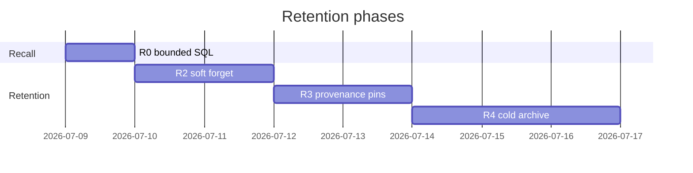

# Episodic retention & recall — implementation plan

> **For agentic workers:** Use superpowers:executing-plans task-by-task. Steps use checkbox (`- [ ]`) syntax.

**Goal:** Keep episodic recall fast and precise as beat volume grows — without deleting honest traces. Bounded SQL retrieval first; soft demotion (decay) second; provenance pins when lattice consolidates; cold archive only when hot tier exceeds policy. **Structural / file-level routing is lattice (semantic), not episodic pull.**

**Architecture:** Chorus owns the episodic substrate (`EpisodicStore` + `recall`). Lattice owns consolidation and emits cited `run_id`s on successful `apply`. Retention is **three independent mechanisms** (do not merge):


| Mechanism               | Question                                    | Owner                                           |
| ----------------------- | ------------------------------------------- | ----------------------------------------------- |
| Consolidation watermark | What is new since last pattern pass?        | lattice `.cursor.json`                          |
| Provenance pin          | Which run_ids must stay hot for drill-down? | chorus row metadata, set at lattice apply       |
| Retrieval policy        | What does default `recall()` surface?       | chorus ranking in `RecallTool` + `EpisodicRepo` |


**Companion docs:**

- [Episodic per-agent record design](../specs/2026-07-08-episodic-per-agent-record-design.md) — Slice A/B (update §4/§10 to SQLite when this lands)
- [Episodic storage engine](2026-07-08-episodic-storage-engine.md) — write path (done)
- [Lattice integration plan](https://github.com/Arceus-Inc/lattice/blob/feat/patterns-only/docs/integration-plan.md) — C-phases for tools; this plan covers **R-phases** (retention/recall)

**Tech stack:** Python 3, `uv`, pytest, `mypy --strict`, `ruff`, SQLite migrations (numbered, byte-parity guarded like ledger).

## Global constraints

- Gate before every commit: `uv run ruff format <paths> && uv run ruff check <paths> && uv run mypy --strict <paths> && uv run pytest <test paths> -q`
- Append-only episodic rows: **never DELETE** cited or pinned rows in v1–v2; demote or archive only.
- `mypy --strict`; no `# type: ignore`.
- `@dataclass(frozen=True)` for new value types; repo = data access only.
- TDD: failing test → minimal code → refactor.

## Design principles (from field + our stack)

1. **Forgetting is a recall-quality problem**, not a disk problem ([Mem0 eviction essay](https://mem0.ai/blog/memory-eviction-and-forgetting-in-ai-agents)).
2. **Soft forget before hard delete** — down-rank at retrieval (Bjork retrieval-strength decay); storage strength stays.
3. **Consolidation is the primary compressor** — lattice patterns + `source_run_ids`; episodic bodies become footnotes.
4. **Pins beat TTL** — cited `run_id`s and failure outcomes (`needs_changes`, `blocked`, `incomplete`) outrank age.
5. **Separate phases** — encode every beat (online); consolidate on gate (offline); archive on schedule (batch).
6. **Episodic pull stays simple** — recency + keyword only. `files_touched` is **capture metadata** for lattice gate/cluster and honest render; not a second retrieval axis in `recall()`.

---

## R1 — fingerprint recall (cancelled, intentional)

**Status:** removed on purpose; do not re-add to `recall()`.

**What we tried / why it hurt:** a `recall(files=…)` overlap rank duplicated lattice's structural clustering, added path-normalization edge cases, and pushed agents toward file-grep resume instead of semantic orientation. Noise paths, stale overlaps, and dual ranking (BM25 + intersection) caused more confusion than cross-beat value.

**Where structural info goes instead:**


| Need                                    | Tool                                                             | Owner                                              |
| --------------------------------------- | ---------------------------------------------------------------- | -------------------------------------------------- |
| "What is durably true about this area?" | `lattice_context(query)`                                         | lattice patterns (keys often file-prefix shaped)   |
| "What beats support this pattern?"      | `source_run_ids` on pattern → `recall(query=…)` or `get(run_id)` | lattice → chorus                                   |
| Gate / cluster input                    | `files_touched` on stored engram                                 | lattice `rank()` / `cluster()` reads episodic rows |


`files_touched` **remains on every captured beat** (write path + recall **output** for resume hints). It is not a **recall input mode**.

---

## Memory tiers (target end state)

```text
┌─────────────────────────────────────────────────────────────┐
│  WORKING (dream)          cleared each beat                 │
├─────────────────────────────────────────────────────────────┤
│  HOT episodic (chorus)    default recall pool               │
│    recall() / recall(query=…)                               │
├─────────────────────────────────────────────────────────────┤
│  COLD episodic (chorus)    get(run_id) + explicit deep search│
│    archived bodies; stub or full row                        │
├─────────────────────────────────────────────────────────────┤
│  SEMANTIC (lattice)       lattice_context(); gate-gated     │
└─────────────────────────────────────────────────────────────┘
```

---

## File structure (net new / modified)


| Path                                                                    | Change                                                                           |
| ----------------------------------------------------------------------- | -------------------------------------------------------------------------------- |
| `src/chorus/memory/repos/episodic.py`                                   | `LIMIT` queries, employee-scoped search, pin/decay columns                       |
| `src/chorus/memory/schema/episodic_record.sql`                          | + `pin_count`, `last_recalled_at`, `tier`                                        |
| `src/chorus/memory/migrations/0002_episodic_retention.sql`              | migration                                                                        |
| `src/chorus/memory/_store.py`                                           | pass-through new repo methods                                                    |
| `src/chorus/memory/_recall_rank.py`                                     | **new** — pure ranking: outcome tier, decay, pins                                |
| `src/chorus_tools/_recall.py`                                           | ranked recency mode, bump `last_recalled_at`                                     |
| `src/chorus_tools/_lattice_pins.py`                                     | **new** (C-bridge) — `pin_run_ids(employee_id, run_ids)` after apply             |
| `tests/memory/test_episodic_repo.py`                                    | **new** — SQL limits, scoped search, pins                                        |
| `tests/memory/test_recall_rank.py`                                      | **new** — ranking unit tests                                                     |
| `tests/tools/test_recall_tool.py`                                       | extend decay / ranking cases                                                     |
| `docs/superpowers/specs/2026-07-08-episodic-per-agent-record-design.md` | §4 storage → SQLite; §11 drop `files` input; point structural routing to lattice |


---

# Phase R0 — Bounded recall (no schema change)

**Problem:** `EpisodicRepo.for_employee` loads every row; recency `recall()` fan-out is O(n).

**Done when:** Recency path never reads more than `limit + 1` rows (extra for current-run exclusion); keyword path unchanged.

### Task R0-1: SQL-bounded recency

**Files:** `src/chorus/memory/repos/episodic.py`, `tests/memory/test_episodic_repo.py`

- [ ] **Step 1:** Failing test — seed 50 rows for one employee; `for_employee(employee_id, limit=5)` returns 5 newest only (assert count via spy or `EXPLAIN` not required; assert ids).
- [ ] **Step 2:** Add `limit: int | None = None` to `for_employee`; append `LIMIT ?` when set.
- [ ] **Step 3:** `RecallTool._recall` recency branch calls `for_employee(..., limit=args.limit + 1)` then filters `own_run_id`.
- [ ] **Step 4:** Gate.

### Task R0-2: Employee-scoped BM25

**Problem:** `search()` is global FTS then filtered by employee in Python.

- [ ] **Step 1:** Failing test — two employees, same keyword in body; search returns only matching employee when `employee_id` filter passed.
- [ ] **Step 2:** Add `search(query, *, employee_id: str | None = None, limit: int = 5)` — join filters `r.employee_id = ?`.
- [ ] **Step 3:** `RecallTool` passes `employee_id` from beat context.
- [ ] **Step 4:** Gate.

---

# Phase R2 — Soft forget (retrieval decay, schema)

**No deletion.** Add metadata for ranking and audit.

### Schema (migration 0002)

```sql
ALTER TABLE episodic_record ADD COLUMN pin_count INTEGER NOT NULL DEFAULT 0;
ALTER TABLE episodic_record ADD COLUMN last_recalled_at TEXT;  -- ISO; NULL = never
ALTER TABLE episodic_record ADD COLUMN tier TEXT NOT NULL DEFAULT 'hot';  -- 'hot' | 'cold'
CREATE INDEX episodic_record_recall_idx ON episodic_record(employee_id, tier, recorded_at DESC);
```

### Task R2-1: Migration + model

- [ ] **Step 1:** Add `schema/episodic_record.sql` + `migrations/0002_episodic_retention.sql`; parity test if one exists for memory schema.
- [ ] **Step 2:** Extend `SprintDelta` or add `EpisodicMeta` read model with optional pin/recall fields (defaults for old rows).
- [ ] **Step 3:** Gate.

### Task R2-2: Ranking module

**Files:** `src/chorus/memory/_recall_rank.py`

**Principle: recency wins.** `recall()` with no args is orientation ("what did I do lately?") — newest beats first. Outcome and pins are **tie-breakers within a recent window**, not global overrides. A 25-day-old `needs_changes` must **not** rank above yesterday's `done`.

#### Where old-session pollution comes from

| Vector | Symptom | Fix |
|---|---|---|
| **Unbounded SQL** | Load 10k rows to return 5 | R0: `ORDER BY recorded_at DESC LIMIT ?` |
| **Too many hits in tool output** | Agent context stuffed with prose | Hard `limit` (default 5) on rendered hits |
| **Bad ranking** | Ancient failure or BM25 match surfaces first | R2: recency-primary; keyword gets recency decay |
| **Prompt push** | Episodes injected into system prompt | We don't — pull-only `recall()` |

Pollution is **what the agent sees in recall output**, not disk size. Bounded fetch + recency-first ordering fixes most of it without deleting rows.

#### Recency mode (`query` omitted)

```python
def sort_recency_hits(deltas: list[SprintDelta], *, now: datetime, limit: int) -> list[SprintDelta]:
    """Newest first. Tie-break only inside RECENT_WINDOW."""
```

1. **Primary sort:** `recorded_at` descending (strict).
2. **Tie-break window:** beats within `RECENT_WINDOW` (default **7 days**) and within **±1 hour** of each other may reorder:
   - failures (`needs_changes`, `blocked`, `incomplete`) before `done` on the same task/file area
   - `pin_count > 0` before unpinned (same timestamp bucket)
3. **Outside window:** pure recency — no failure boost.

| Signal | Role | Notes |
|---|---|---|
| `recorded_at` | **primary** | newer always beats older |
| failure outcome | tie-break | only inside 7d window, same-hour bucket |
| `pin_count > 0` | tie-break | lattice drill-down; never beats a newer unpinned beat |
| `last_recalled_at` | tie-break | +1 rank step if recalled in last 7d **and** same day as peer |
| old `done`, unpinned | default | naturally falls off — not in top‑K by recency |

**Do not** use additive +100/+50 weights — they invert recency (the bug in the draft table).

#### Keyword mode (`query` set)

1. BM25 over intent + body (employee-scoped, R0).
2. Multiply BM25 score by **recency decay:** `exp(-age_days / τ)` with τ ≈ 14 (Mem0-style dampening, not eviction).
3. **Exception:** `pin_count > 0` skips decay floor (pattern-cited beats stay findable by keyword).
4. Return top `limit` after re-rank.

- [ ] **Step 1:** Unit tests — (a) beat from yesterday beats beat from 20 days ago regardless of outcome; (b) two beats same hour: failure ranks above done; (c) keyword "retry": recent hit beats old hit with same BM25; (d) pinned old beat still retrievable by keyword.
- [ ] **Step 2:** Implement.
- [ ] **Step 3:** Recency path uses SQL order + optional in-window tie-break only; no Python re-rank over a huge pool unless tie-break needed.
- [ ] **Step 4:** Gate.

### Task R2-3: Recall bump

- [ ] **Step 1:** After successful recall render, `EpisodicRepo.touch_recalled(run_ids, now)` sets `last_recalled_at` (batch update, one transaction).
- [ ] **Step 2:** Test touch is best-effort; recall never fails if touch fails.
- [ ] **Step 3:** Gate.

---

# Phase R3 — Provenance pins (lattice × chorus)

**When:** Successful `lattice_apply` with patterns citing `source_run_ids`.

### Task R3-1: Pin API (chorus)

**Files:** `src/chorus/memory/repos/episodic.py`, `EpisodicStore.pin_run_ids(employee_id, run_ids)`

- [ ] **Step 1:** Failing test — pin increments `pin_count` idempotently per apply batch (same run_id pinned twice → count +1 once per apply call, or +1 total ever — **pick: increment once per successful apply citation**, document).
- [ ] **Step 2:** Implement `UPDATE episodic_record SET pin_count = pin_count + 1 WHERE run_id IN (...) AND employee_id = ?`.
- [ ] **Step 3:** Gate.

### Task R3-2: Lattice apply hook (chorus_tools)

**Files:** `src/chorus_tools/_lattice_apply.py` (when C-phase lands), or interim helper

- [ ] **Step 1:** After `lattice.apply(proposal)` returns `ok`, collect all `source_run_ids` from proposal patterns; call `store.pin_run_ids(proposal.employee_id, ids)`.
- [ ] **Step 2:** Integration test with fake lattice + real EpisodicStore.
- [ ] **Step 3:** Document in lattice `integration-plan.md` § provenance chain.

**Pin rules (normative):**

- Never archive/delete while `pin_count > 0`.
- Failures (`needs_changes`, `blocked`, `incomplete`) never auto-archive in v2 (ranking only).

---

# Phase R4 — Cold archive (defer until hot > policy)

**Trigger:** Per-employee hot row count > `HOT_CAP` (default 500) OR hot DB size > `HOT_MB` (default 256). Batch job, not inline at beat-end.

### Task R4-1: Archive table

```sql
CREATE TABLE episodic_archive ( ... same columns as episodic_record ... );
```

- [ ] Move eligible rows: `tier='hot'`, `pin_count=0`, `outcome='done'`, `recorded_at` older than watermark, not in last K beats.
- [ ] `get(run_id)` checks hot then archive.
- [ ] `recall()` searches hot only by default; optional `deep=True` includes archive FTS (later).

**Explicitly out of scope for R4 v1:** deleting bodies; compliance TTL (separate policy doc).

---

# Phase R5 — Spec & ops hygiene

### Task R5-1: Update episodic design spec

- [ ] §4 — `EpisodicStore` / `episodic.db` replaces markdown layout narrative.
- [ ] §11 — recency + `query` only; ranking, decay, pins; `get(run_id)` for pattern drill-down; **remove `files` recall input**; note lattice owns structural routing.
- [ ] §10 deferred — move "FTS5 index" to done; add "cold archive" to deferred.

### Task R5-2: Observability

- [ ] `EpisodicStore.stats(employee_id) -> {hot_count, cold_count, pinned_count}` for heartbeat logs / debug.

---

## Implementation order

```text
R0 (bounded SQL)     ──► ship immediately; fixes latency cliff
R1 (fingerprint)     ──► CANCELLED — structural routing via lattice semantic layer
R2 (soft forget)     ──► needs migration; no user-visible breakage
R3 (pins)            ──► requires lattice_apply wiring (C-phase)
R4 (cold archive)    ──► only when metrics say so
R5 (docs)            ──► alongside each phase; align spec §11 with no files input
```




---

## Test matrix


| Scenario                    | Phase   | Expected                                                         |
| --------------------------- | ------- | ---------------------------------------------------------------- |
| 1000 beats, recency limit=5 | R0      | ≤6 SQL rows read                                                 |
| Same module across beats    | lattice | `lattice_context` + pattern key; drill-down via `source_run_ids` |
| Old done + new failure (same hour) | R2      | failure tie-breaks above done; both recent                         |
| Failure 20d ago vs done yesterday  | R2      | **yesterday wins** — recency primary                               |
| Pattern cites r_1, r_2             | R3      | pin_count > 0; keyword recall skips decay floor                    |
| get(r_1) after archive      | R4      | returns body from cold                                           |


---

## Non-goals (this plan)

- LLM-driven eviction (Mem0 DELETE at write) — beliefs live in lattice proposals, not episodic mutation.
- TTL deletion of beat traces — compliance mode is a separate spec.
- `**recall(files=…)` fingerprint overlap** — cancelled; lattice semantic layer owns structural routing; `files_touched` stays write/render metadata only.
- Embedding-based recurrence — lattice gate uses structural clusters; embeddings deferred.
- Dream memory dir reconciliation — tracked in episodic spec §4 loop-close note.

---

## Success criteria

1. **Latency:** recency recall p99 stable as row count → 10k/employee (SQL bounded).
2. **Quality:** cross-beat resume uses `lattice_context` → cited `run_id`s → `recall(query=…)` / `get(run_id)`; episodic keyword finds prose when needed.
3. **Retention:** hot store bounded by R4 policy; zero pinned run_id loss; audit trail recoverable via cold tier.
4. **Blend:** lattice `source_run_ids` → pinned → `recall` drill-down closes the CLS loop.

Co-Authored-By: Claude Opus 4.8 [noreply@anthropic.com](mailto:noreply@anthropic.com)